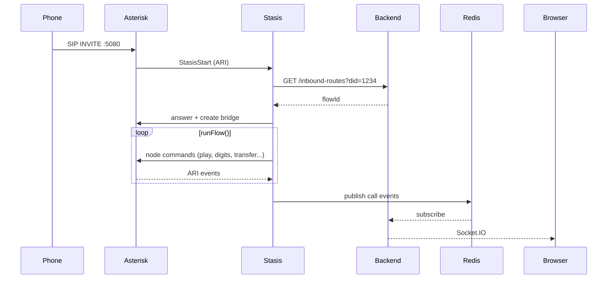

# Architecture

## Overview

Callytics is a self-hosted call-center stack built around Asterisk, a Stasis call execution service, a NestJS backend, PostgreSQL, Redis, and a React frontend. Asterisk handles SIP and media, Stasis runs the active call logic, the backend owns the management API and operational features, PostgreSQL stores durable data, Redis carries live events and short-lived state, and the frontend gives you the browser interface.

You design and publish flows in the browser. The backend stores and prepares that configuration, and new calls are executed by Stasis against the published flow state — no manual dialplan editing required.

### Container topology

```
┌─────────────────────────────────────────────────────────┐
│                      host network                       │
│                                                         │
│  ┌─────────────┐   ARI :8088   ┌─────────────┐          │
│  │  asterisk   │◄─────────────►│   stasis    │          │
│  │  SIP :5080  │   AMI :5038   │             │          │
│  │  RTP 10000- │◄──────────────│             │          │
│  │  20000      │               └──────┬──────┘          │
│  └─────────────┘                      │                 │
│                                       │ Redis :6380     │
│  ┌─────────────┐                      │                 │
│  │   backend   │◄─────────────────────┘                 │
│  │   :3001     │                                        │
│  └──────┬──────┘                                        │
│         │ :5432 PostgreSQL                              │
│         │ :6380 Redis                                   │
└─────────┼───────────────────────────────────────────────┘
          │
    ┌─────▼──────┐    ┌─────────────┐    ┌─────────────┐
    │  postgres  │    │    redis    │    │  frontend   │
    │  :5432     │    │  :6380      │    │  :3000      │
    │  (bridge)  │    │  (bridge)   │    │  (bridge)   │
    └────────────┘    └─────────────┘    └─────────────┘
```

## Service Breakdown

**Asterisk** is the telephony engine. It accepts SIP traffic on port `5080`, handles RTP media, manages bridges and recordings, and exposes two control interfaces: ARI on `127.0.0.1:8088` and AMI on `127.0.0.1:5038`.

**Stasis** is the call execution runtime. It connects to Asterisk over ARI WebSocket, receives live `StasisStart` events, loads the published call flow, walks each node, sends ARI commands back to Asterisk, and publishes timeline and telemetry events to Redis.

**NestJS backend** serves the management API on port `3001`, handles configuration for extensions, trunks, flows, campaigns, firewall, VPN, backups, diagnostics, and recordings, subscribes to Redis pub/sub channels, and relays real-time events to the browser over Socket.IO.

**PostgreSQL** stores all durable data: flows, flow versions, extensions, trunks, inbound routes, call logs, recordings metadata, campaigns, operators, queues, firewall rules, and backups. Bound to `127.0.0.1:5432`.

**Redis** is the live event and coordination layer. It runs on `127.0.0.1:6380` on the host (mapped from container port `6379`) and carries telemetry between Stasis and the backend, queue and operator state, campaign coordination, SIP capture data, and short-lived runtime state.

**Frontend** is the React browser application. It connects to the backend on port `3001` and uses Socket.IO for real-time updates across all live pages.

## Why Host Networking

ARI communicates over `127.0.0.1:8088` and AMI over `127.0.0.1:5038`. Both are loopback addresses on the host. If Stasis or the backend ran on a Docker bridge network, they could not reach these loopback addresses — bridge containers see a different network namespace.

SIP binds on `0.0.0.0:5080`, not the default `5060`, because the host machine typically already occupies port `5060` with a system SIP service or another process. Using `5080` avoids that conflict.

Host networking also means Asterisk, Stasis, and the backend all share the same network namespace. RTP media and SIP signaling bind directly to the host's network interfaces, avoiding the bridge and NAT translation problems that commonly break SIP audio paths in Docker setups.

The optional WireGuard VPN container is different: it terminates VPN tunnels rather than owning SIP/RTP sockets, so it can run on a bridge network and publish only UDP port `51820`.

## Call Execution Path

1. Inbound SIP INVITE arrives at Asterisk on port `5080`
2. Asterisk matches the DID in `extensions_callytics_inbound.conf` — auto-generated by the backend whenever inbound routes change
3. Asterisk sends the channel to the Stasis app named `callytics`
4. Stasis `StasisStart` fires — checks if `channelExten` starts with `#` (direct outbound) or is a DID (inbound flow)
5. For inbound: Stasis calls `GET /inbound-routes?did=<DID>` on the backend to resolve the flow ID
6. Stasis fetches flow nodes and edges, answers the channel, creates an ARI bridge of type `mixing,dtmf_events`, runs `runFlow()`
7. `runFlow()` is an in-memory loop — `CallSession` tracks `currentNodeKey`, follows edges after each node result
8. Already-running calls keep their in-memory session — saving a flow affects subsequent calls only
9. Stasis publishes events to Redis pub/sub as the call progresses
10. Backend subscribes to Redis, writes durable records to PostgreSQL, relays real-time updates to browser via Socket.IO



## Redis as the Event Backbone

Redis decouples call execution (Stasis) from durable storage and browser updates (backend). Stasis publishes fast operational events without knowing which consumers are listening. The backend subscribes and handles persistence and real-time relay independently.

### Pub/sub channels

| Channel | Purpose |
|---|---|
| `callytics:call-events` | Call started, answered, ended — written to call log |
| `callytics:call-timeline` | Node-by-node execution trace for the per-call timeline view |
| `callytics:sip-status` | SIP registration state and trunk status updates |
| `callytics:sip-traffic` | Parsed SIP messages from the AMI PJSIP logger for the capture page |
| `callytics:sip-capture` | Redis stream for raw tshark packets when `TSHARK_ENABLED=true` |
| `callytics:campaign:*` | Campaign dial events, contact outcomes, window coordination |
| `callytics:callback:*` | Callback request events and execution coordination |

Redis also carries short-lived coordination state as keys:

- `queue:<id>:operators` — set of ARI channel IDs for logged-in operators
- `operator:<id>:queue` — the queue ID the operator is currently logged into
- `operator:<id>:channel` — the operator's live ARI channel ID

## Real-Time Updates

The full chain from a call event to the browser:

```
Stasis → Redis pub/sub → NestJS subscribes → Socket.IO → browser
```

The backend subscribes to Redis channels on startup. When an event arrives it processes the payload, persists what needs persisting, then emits a Socket.IO event to connected browsers.

### Socket.IO events by page

| Page | Socket.IO events consumed |
|---|---|
| Call Logs | `call:event`, `call:timeline` |
| Live Dashboard | `call:event`, `queue:state`, `operator:state` |
| Diagnostics | `sip:status`, `sip:registration` |
| SIP Capture | `sip:traffic`, `sip:capture-packet` |
| Campaigns | `campaign:progress`, `campaign:contact-result` |
| Firewall | `firewall:event`, `firewall:block` |
