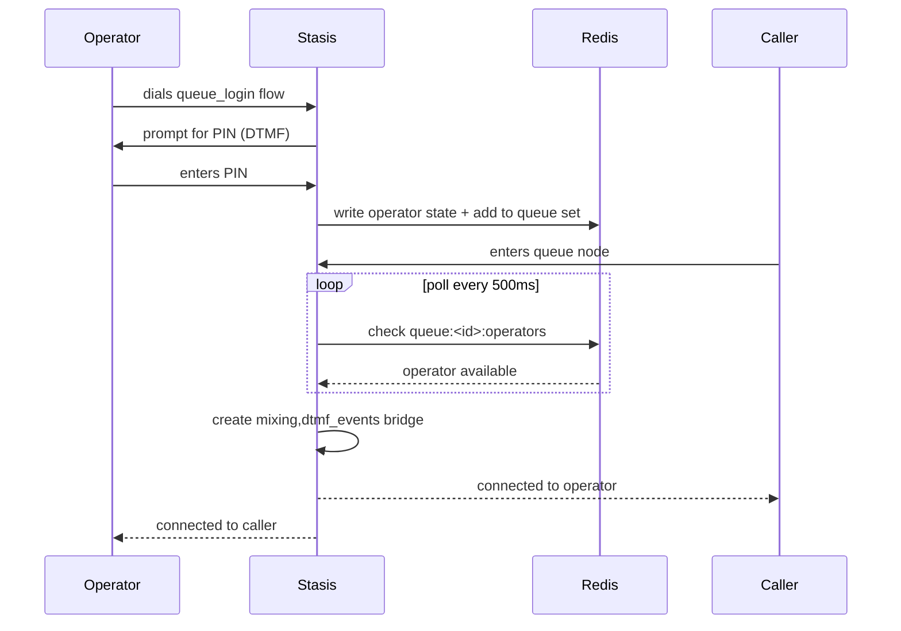

# Queues & Operators

Queues & Operators provide structured call distribution for teams that answer shared inbound calls. Callers wait in a queue while Callytics connects them to available operators based on the queue setup.

Operators log in from their softphone by entering a PIN — no admin UI interaction needed to change availability. The system tracks whether operators are available, busy, or offline so you can understand staffing in real time.

Queue live state is held entirely in Redis. PostgreSQL is never polled for queue state — only Redis keys determine who is available and whether a match can be made.

```
Operator softphone                Caller softphone
      │                                 │
      │ dials queue_login flow          │ dials inbound DID
      ▼                                 ▼
┌─────────────┐                  ┌─────────────┐
│ queue_login │                  │    queue    │
│    node     │                  │    node     │
└──────┬──────┘                  └──────┬──────┘
       │ DTMF PIN match                 │ polls Redis every 500ms
       ▼                                │ queue:<id>:operators
┌─────────────────────┐                 │
│       Redis         │◄────────────────┘
│ operator:<id>:queue │
│ operator:<id>:chan  │────────────────► bridge created
│ queue:<id>:operators│                 mixing,dtmf_events
└─────────────────────┘
```

## Operator Login Flow

Operators are created in the Operators page. Each operator can have a linked SIP extension and a hashed PIN (`operators.pin_hash`). To log into a queue, the operator calls their softphone into a flow that contains a `queue_login` node.

**Login sequence:**

1. Operator dials into a flow containing a `queue_login` node
2. Stasis prompts for PIN via DTMF
3. Stasis matches the entered digits against `operators.pin_hash` in the database
4. On successful match, Stasis writes to Redis:
   - `operator:<id>:queue` = queue ID
   - `operator:<id>:channel` = ARI channel ID
   - Adds the operator's channel to the `queue:<id>:operators` set
5. The operator is now visible as available in the live dashboard
6. To log out, the operator dials `#` during the PIN prompt

## Queue Matching Flow

When a caller hits a `queue` node in a flow:

1. Stasis checks the `queue:<id>:operators` set in Redis for available operator channels
2. If no operators are available, Stasis polls Redis every 500ms
3. When an operator channel appears in the set, Stasis creates a `mixing,dtmf_events` ARI bridge between the caller channel and the operator channel
4. Both parties are connected — the bridge type `mixing,dtmf_events` is required to prevent Asterisk from upgrading to a native RTP bridge, which would break audio through NAT after approximately 30 seconds
5. If the caller abandons or the timeout expires, the queue node follows the configured abandon or timeout edge



## Capabilities

- Queue-based inbound call distribution
- Operator PIN login from softphone keypresses
- Real-time operator status: available, busy, or offline
- Caller wait handling when no operator is free
- Abandoned-call routing
- Timeout routing
- Live dashboard visibility for queues and operators
