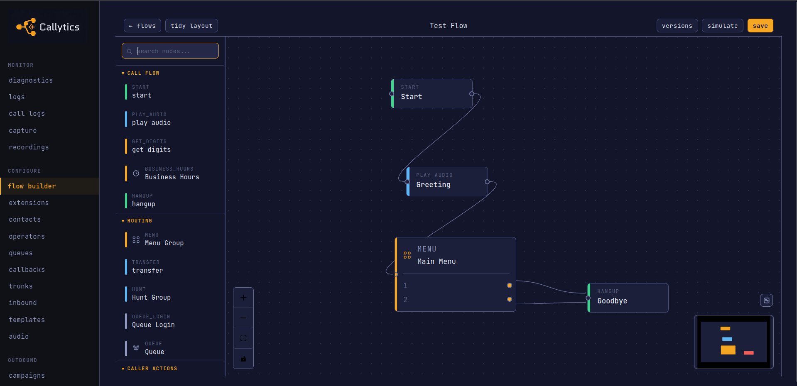
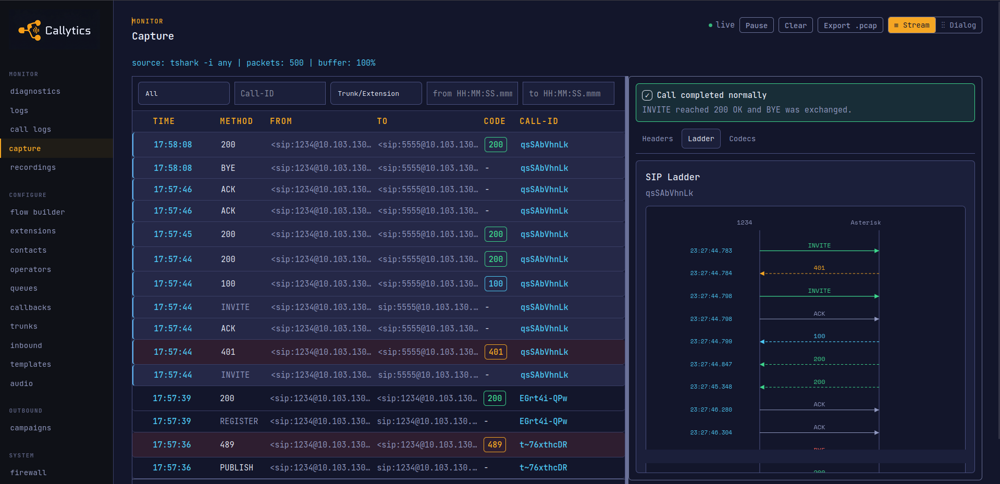
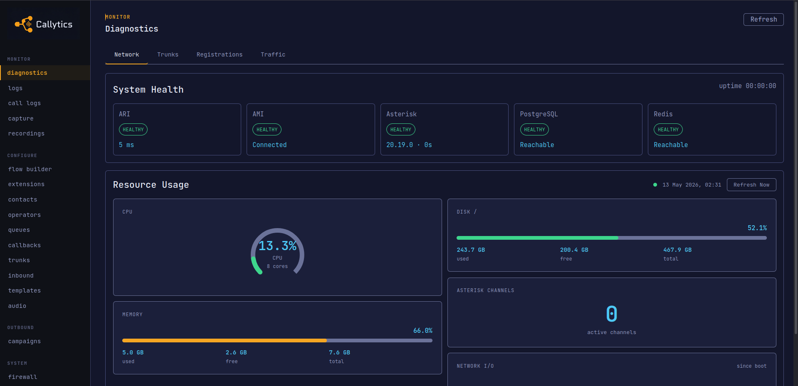
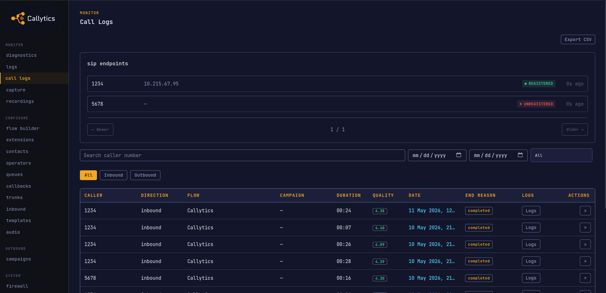
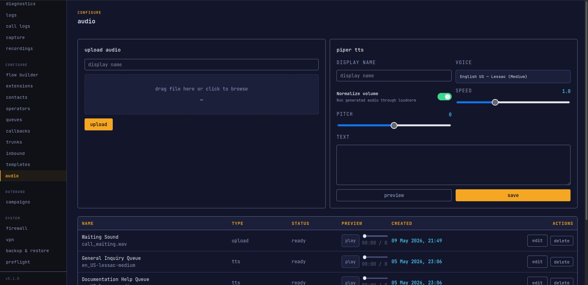
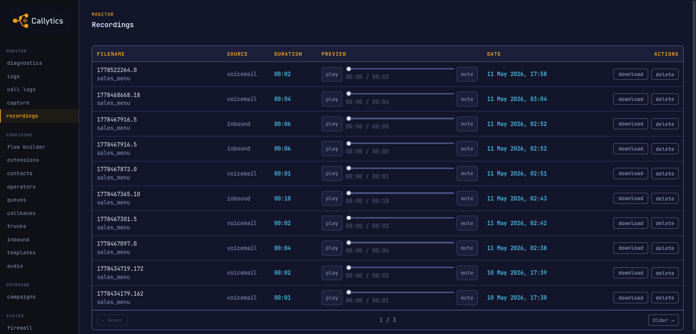
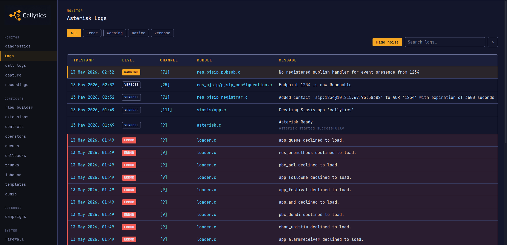
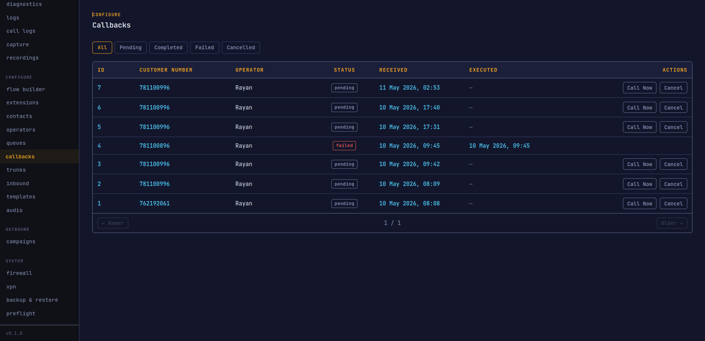
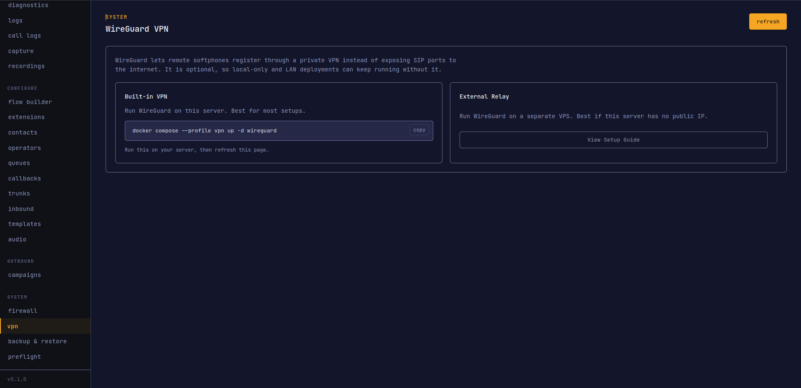
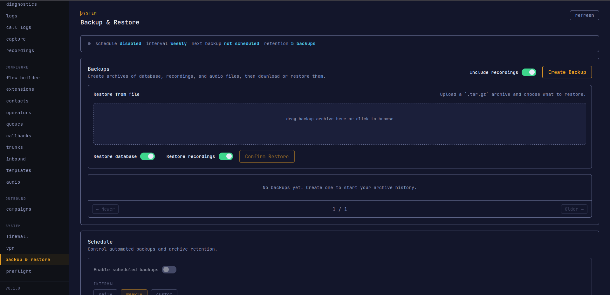

# Screenshots

This page is a visual tour of the main Callytics screens. Replace the placeholder images with real screenshots from your deployment.

## Flow Builder

This is the visual IVR canvas where flows are built with drag and drop nodes. It shows how menus, routing, playback, queues, and other call steps connect.

## SIP Ladder Diagram

This view shows a single call's SIP exchange in sequence. It is useful when you need to see where setup failed or export the traffic as a `.pcap`.

## Dashboard & Diagnostics

This screen shows the overall system state in one place. You can check service health, SIP status, and uptime without going to the shell.

## Call Logs

This is the call history view for searching and inspecting completed calls. It is where you check call status, trace flow execution, and export CDR data.

## Audio Manager

This page is where prompts are uploaded, previewed, and organized. It also includes offline Piper TTS and an audio preview player for checking generated prompts.

## Recordings

This screen lists bridged call recordings and lets you review them in the browser. Use it when you need to replay a completed conversation or download the file.

## Asterisk Logs

This is the live Asterisk log viewer inside the UI. It helps when you want to inspect telephony events without tailing logs in the container.

## Callbacks

This screen covers inbound callback workflows. It is where scheduled callbacks are managed.

## WireGuard VPN

This page shows the relay and peer setup for WireGuard access. QR provisioning is used here to onboard remote devices quickly.

## Backup & Restore

This screen is for scheduled backups and recovery. It shows saved archives and gives you a direct restore path when you need to roll back.

